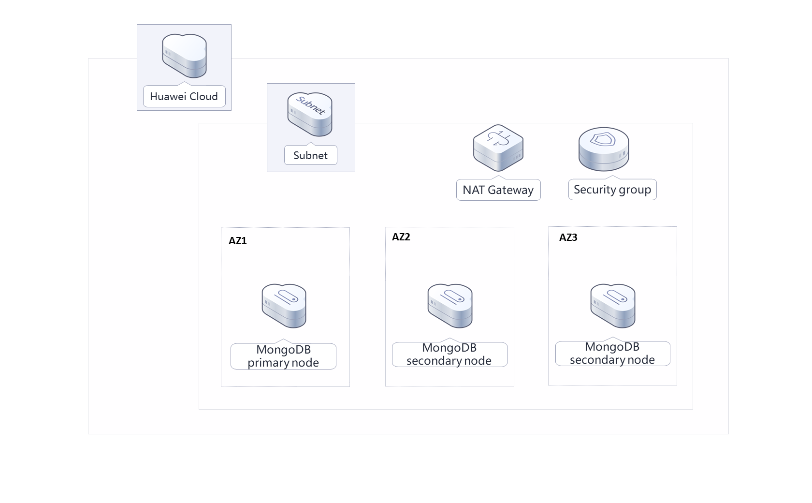
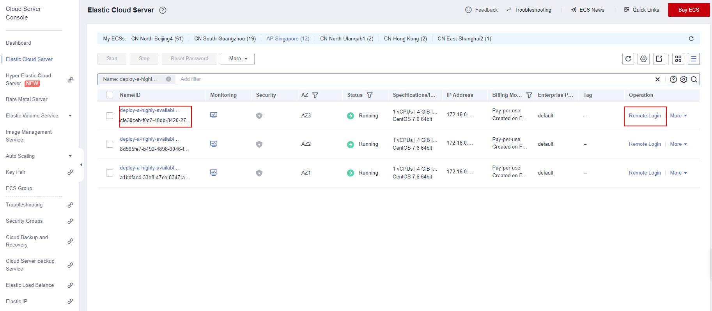
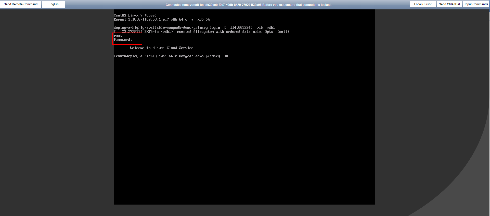
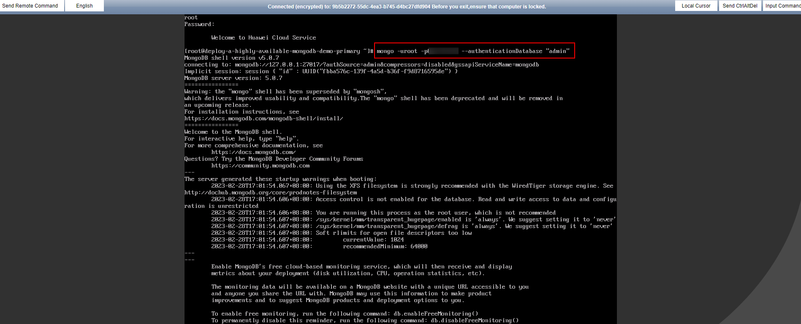

[TOC]

**Solution Overview**
===============
This solution helps you build a MongoDB replica set on Huawei Cloud ECSs. MongoDB is an open-source NoSQL database, where key-value pairs are stored as a document. Each MongoDB replica set contains primary and secondary nodes so that the replica set can recover automatically once a fault occurs.

For more details about this solution, visit: https://www.huaweicloud.com/intl/en-us/solution/implementations/qdhamd.html

**Architecture**
---------------


**Architecture Description**
---------------
This solution will:

- Create three ECSs. These ECSs will be used for deploying one primary node and two secondary nodes for a MongoDB replica set at different AZs.
- Create a public NAT gateway and configure SNAT rules so that database nodes can access Internet unidirectionally, making O&M easy while ensuring database access security.

**File Structure**
---------------

``` lua
huaweicloud-solution-deploy-a-highly-available-mongodB
├── deploy-a-highly-available-mongodB.tf.json -- Resource orchestration template
├── userdata
	├── install_primary_db.sh  -- Script configuration file
	├── install_secondary_db01.sh  -- Script configuration file
	├── install_secondary_db02.sh  -- Script configuration file
```
**Getting Started**
---------------
1. Lon in to the [ECS](https://console-intl.huaweicloud.com/ecm/?agencyId=WOmAijZnbElNjCFzTVDl4aJQAgdaTUMD&region=ap-southeast-3&locale=en-us#/ecs/manager/vmList) console. Select an ECS whose name is suffixed by primary and click Remote Login.

	Figure 1 Logging in to the ECS console

	

	Figure 2 Logging in to the Linux ECS

	
2. Run mongo -uroot -pPassword --authenticationDatabase "admin" to log in to the MongoDB database. If the command output contains PRIMARY, the MongoDB database is deployed successfully.

	Figure 3 Database connection

	